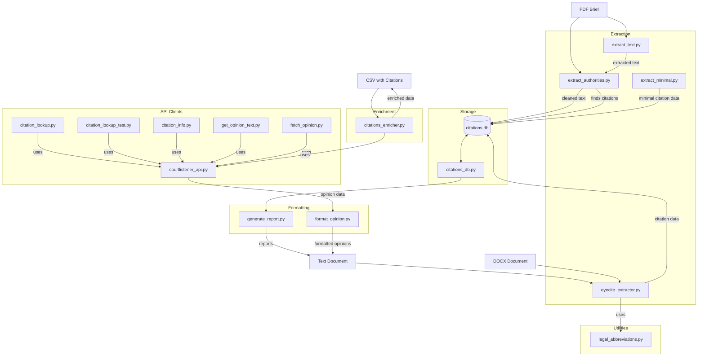

## Component Interaction Description

The diagram above illustrates the primary components of the Brief Analyzer codebase and how they interact:

1. **Extraction Layer**:
   - PDF briefs are processed by `extract_text.py` to extract raw text
   - `extract_authorities.py` identifies the Table of Authorities and extracts citations
   - `eyecite_extractor.py` provides more general-purpose citation extraction
   - `extract_minimal.py` offers simplified citation extraction

2. **API and Lookup Layer**:
   - `courtlistener_api.py` is the core API client used by other modules
   - `citation_lookup.py` provides a simple citation lookup interface
   - `citation_lookup_test.py` offers an interactive testing interface
   - `citation_info.py` is a command-line utility for citation information
   - `get_opinion_text.py` retrieves full opinion text
   - `fetch_opinion.py` is an interactive tool to fetch and save opinions

3. **Enrichment Layer**:
   - `citations_enricher.py` adds metadata to citation records in CSV files

4. **Formatting Layer**:
   - `format_opinion.py` converts opinion data to various formats (HTML, PDF, etc.)
   - `generate_report.py` creates reports from citation data

5. **Storage Layer**:
   - `citations.db` stores citation data in SQLite format
   - `citations_db.py` provides the database interface

6. **Utilities**:
   - `legal_abbreviations.py` helps with abbreviation expansion to improve citation extraction 